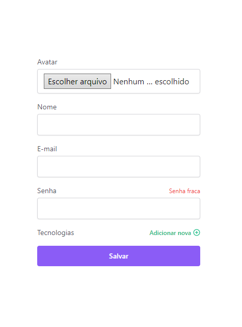
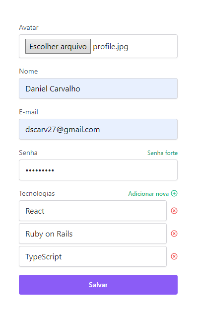

# forms-react

<h2 align="center">Criando um formulário avançado com React!</h2>

<br><br>

<p align="center">
  <a href="#sobre">Sobre</a> •
  <a href="#instalação">Instalação</a> •
  <a href="#tecnologias">Tecnologias</a> •
  <a href="#autor">Autor</a>
</p>

## Sobre
Formulários são umas das melhores formas de interação entre usuários e o software. Na programação, utilizamos para coletar informações do usuário em muitas aplicações, incluindo formulários de registro, formulários de login, questionários, enquetes, etc.

Os dados coletados através dos formulários podem ser usados para uma variedade de fins, como armazenamento em banco de dados, processamento de transações, personalização de conteúdo, geração de relatórios, entre outros.

<span justify-content="space-around">
  
  
</span>

## Instalação

Antes de começar, você vai precisar ter instalado em sua máquina as seguintes ferramentas:
[Git](https://git-scm.com), [Node.js](https://nodejs.org/en/), [pnpm](https://pnpm.io/pt/installation).

```bash
# Clone este repositório
$ git clone https://github.com/dscarv27/forms-react

# Acesse a pasta do projeto no terminal/cmd
$ cd forms-react

# Atualize as dependência com o pnpm
$ pnpm i

# Execute a aplicação em modo de desenvolvimento
$ pnpm dev

# O servidor inciará na porta 5173 - acesse <http://localhost:5173>
```

## Tecnologias


<br><br><br>

## Autor

<div align="center">
  <h1>Daniel Carvalho</h1>
  <strong>Full Stack Developer</strong>
    <br><br>

<a href="https://linkedin.com/in/dscarv27" target="_blank">
  
</a>

<a href="https://github.com/dscarv27" target="_blank">
  
</a>

<a href="mailto:dscarv27@gmail.com?subject=Fala%20Dev" target="_blank">
  
</a>

<a href="https://api.whatsapp.com/send?phone=5521972275757" target="_blank">
  
</a>

</div>
